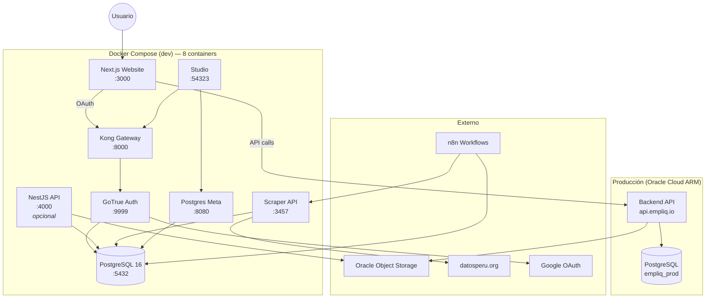
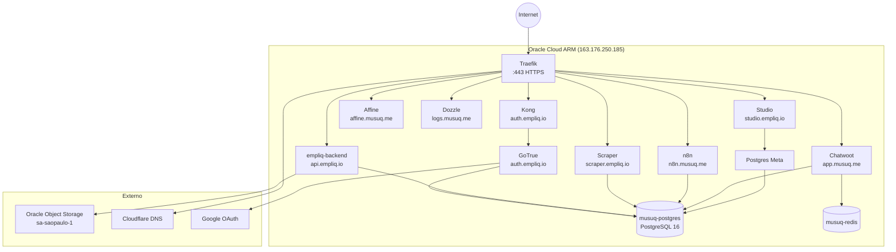
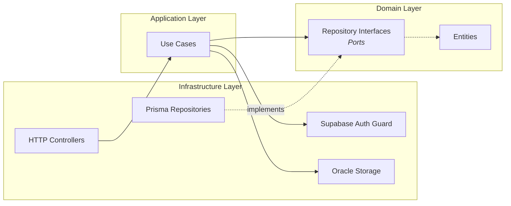
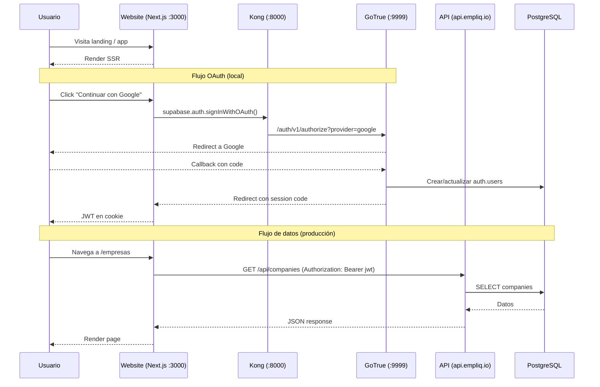
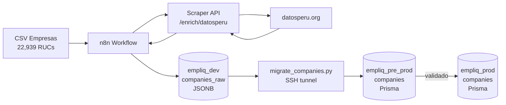
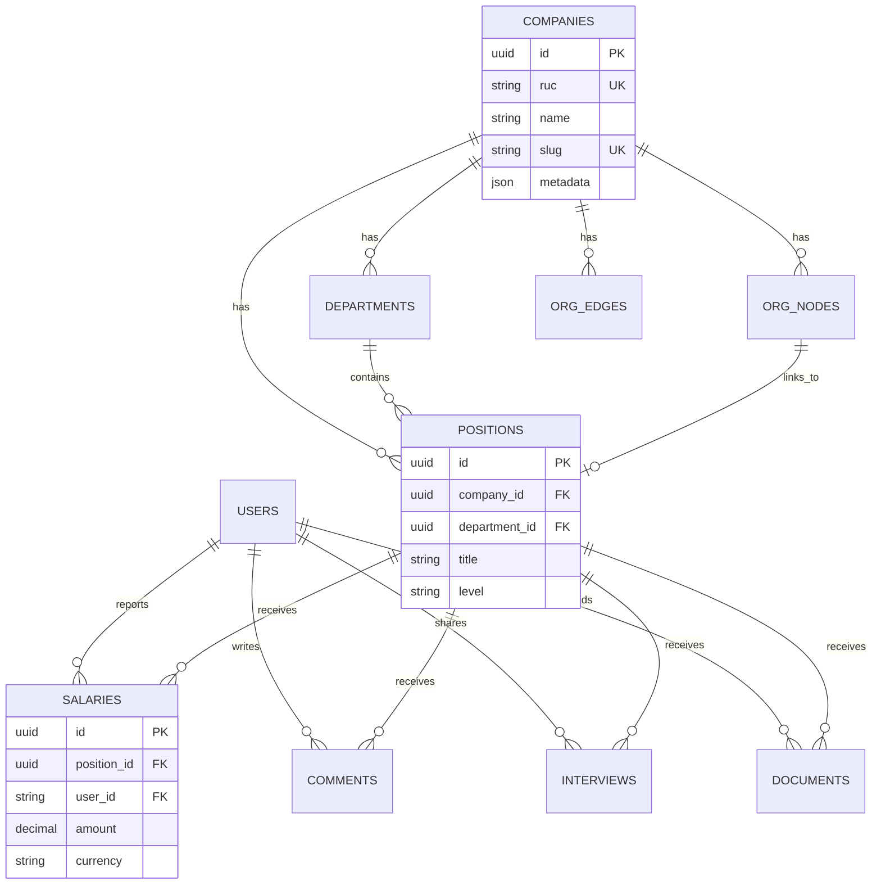

# Empliq — Arquitectura del Sistema

> Diagramas y descripción de la arquitectura. Documenta el **por qué**, no el **qué**.

---

## Diagrama de Contenedores (Docker)

### Entorno Local (dev)

> **Nota:** El website local consume el API **local** (`localhost:4000`) que conecta
> a `empliq_pre_prod`. Supabase Auth (GoTrue) corre local para desarrollo de OAuth
> sin afectar producción. Para consumir la API de producción, cambiar
> `NEXT_PUBLIC_API_URL=https://api.empliq.io/api` en `docker/.env`.
>
> **Base de datos local:** `empliq_pre_prod` — staging con estructura Prisma idónea.
> GoTrue local también conecta a `empliq_pre_prod` (schema `auth` separado del `public`).

### Producción (Oracle Cloud ARM)

---

## Arquitectura Hexagonal (API)

**Principio:** El dominio no depende de nada externo. Los puertos (interfaces) viven en `domain/`, las implementaciones en `infrastructure/`.

---

## Flujo de Datos

---

## Pipeline de Datos (Scraping)

**Estado actual:** ~19,000+ empresas enriquecidas en empliq_dev (Tier 1-5).

### Arquitectura de 3 Bases de Datos

| BD | Host | Propósito | Schema |
|---|---|---|---|
| `empliq_dev` | Oracle Cloud (musuq-postgres) | Raw data scrapers (JSONB) | `companies_raw` sin estructura |
| `empliq_pre_prod` | Local Docker (empliq-postgres) | Staging/testing con Prisma | Prisma schema + auth |
| `empliq_prod` | Oracle Cloud (musuq-postgres) | Producción real | Prisma schema + auth |

**Regla:** Los datos fluyen `empliq_dev → empliq_pre_prod → empliq_prod`. Nunca al revés.
Ver `docs/technical/DATABASE_SAFETY.md` para reglas críticas.

---

## Modelo de Datos (ER Simplificado)

---

## Stack Tecnológico

| Capa | Tecnología | Versión | Propósito |
|------|-----------|---------|-----------|
| Website | Next.js | 16.x | Landing SSR + App |
| UI Kit | TailwindCSS + shadcn/ui | 4.x | Estilos utility-first |
| Organigrama | ReactFlow | - | Visualización interactiva |
| 3D | Three.js | - | Shader background |
| Animaciones | Framer Motion | - | Micro-interacciones |
| Backend | NestJS | 11.x | API REST (hexagonal) |
| ORM | Prisma | 6.x | Abstracción DB |
| Base de datos | PostgreSQL | 16.x | Persistencia |
| Auth | Supabase GoTrue | v2.158.1 | Google OAuth self-hosted |
| API Gateway | Kong | 2.8.1 | Proxy /auth/v1/* → GoTrue |
| Storage | Oracle Object Storage | - | Logos, archivos (PAR upload) |
| Scraper | NestJS microservice | - | DatosPeru enrichment |
| Automatización | n8n | - | Pipelines de datos |
| Infra | Oracle Cloud ARM | A1.Flex 4c/24GB | Servidor producción |
| Reverse Proxy | Traefik | 3.x | HTTPS + routing (Cloudflare DNS) |
| Containers | Docker + Compose | - | Entorno dev/prod |
| CI/CD | GitHub Actions | - | Deploy automático |

---

## Subdominios de Producción

| Subdominio | Servicio | Descripción |
|------------|----------|-------------|
| `api.empliq.io` | empliq-backend | Backend API (NestJS) |
| `auth.empliq.io` | empliq-kong | Supabase API Gateway (GoTrue) |
| `studio.empliq.io` | empliq-studio | Dashboard Supabase |
| `scraper.empliq.io` | empliq-scraper | Scraper API |
| `n8n.musuq.me` | n8n | Automatización |
| `app.musuq.me` | chatwoot | Soporte |
| `affine.musuq.me` | affine | Docs/Whiteboard |
| `logs.musuq.me` | dozzle | Log viewer |
| `traefik.musuq.me` | traefik | Dashboard Traefik |

---

## Repos

| Repo | Contenido | Deploy |
|------|-----------|--------|
| `CareerWiki` (monorepo) | `apps/{api, website, empliq-scraper-api}`, docs, scripts | — |
| `empliq-backend` | Backend API standalone (clon de `apps/api`) | `api.empliq.io` |
| `musuq-platform` | Scripts infra Oracle Cloud, CI/CD, Docker services | Oracle ARM |

---

## Decisiones Arquitectónicas

Las decisiones técnicas importantes están documentadas como ADRs en [`decisions/`](./decisions/).

| ADR | Decisión |
|-----|----------|
| [001](./decisions/001-hexagonal-architecture.md) | Arquitectura hexagonal para API y Scraper |
| [002](./decisions/002-better-auth.md) | Supabase Self-Hosted (GoTrue) para Auth |
| [003](./decisions/003-dual-database-jsonb.md) | Dual DB: JSONB para scraper, Prisma para app |
| [004](./decisions/004-datosperu-only-pipeline.md) | Pipeline solo DatosPeru (sin búsqueda web) |
| [005](./decisions/005-monochromatic-design.md) | Diseño monocromático para website |
| [006](./decisions/006-oracle-cloud-arm.md) | Oracle Cloud ARM para producción |
