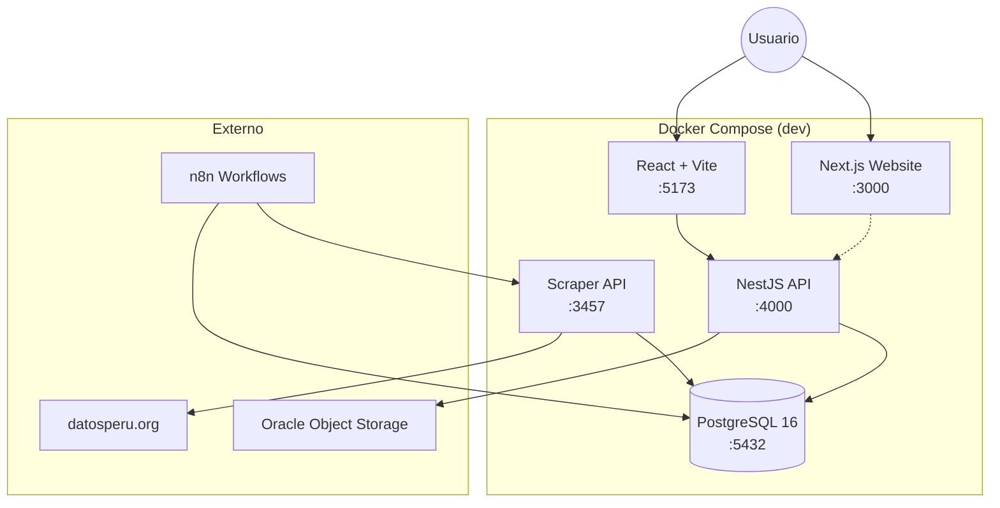
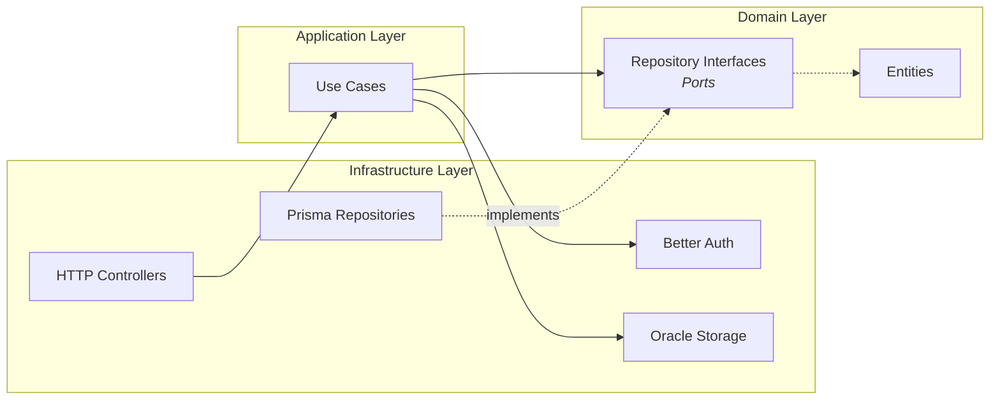
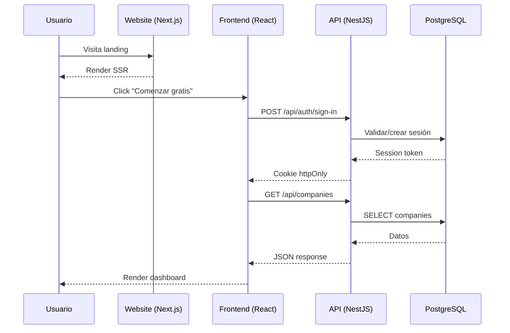
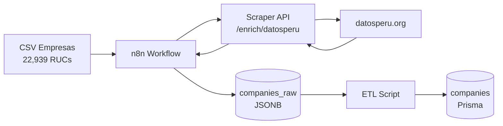
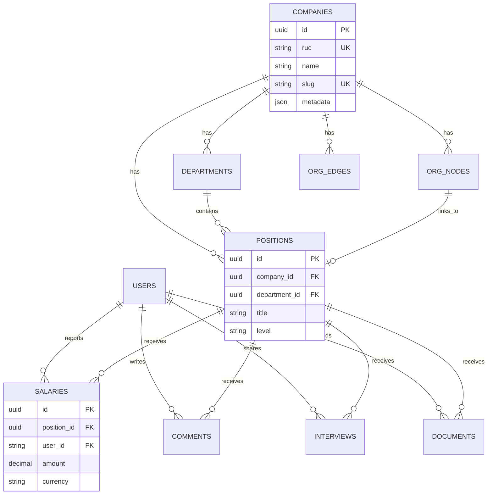

# Empliq — Arquitectura del Sistema

> Diagramas y descripción de la arquitectura. Documenta el **por qué**, no el **qué**.

---

## Diagrama de Contenedores (Docker)

---

## Arquitectura Hexagonal (API)

**Principio:** El dominio no depende de nada externo. Los puertos (interfaces) viven en `domain/`, las implementaciones en `infrastructure/`.

---

## Flujo de Datos

---

## Pipeline de Datos (Scraping)

**Estado actual:** Tier 1-3 completado (6,123 empresas). Tier 4-5 pendiente (16,816).

---

## Modelo de Datos (ER Simplificado)

---

## Stack Tecnológico

| Capa | Tecnología | Versión | Propósito |
|------|-----------|---------|-----------|
| Frontend App | React + Vite | 19.x / 6.x | Dashboard SPA |
| Website | Next.js | 16.x | Landing SSR |
| UI Kit | TailwindCSS + shadcn/ui | 4.x | Estilos utility-first |
| Organigrama | ReactFlow | - | Visualización interactiva |
| 3D | Three.js | - | Shader background |
| Animaciones | Framer Motion | - | Micro-interacciones |
| Backend | NestJS | 11.x | API REST (hexagonal) |
| ORM | Prisma | 6.x | Abstracción DB |
| Base de datos | PostgreSQL | 16.x | Persistencia |
| Auth | Better Auth | - | Sesiones + OAuth |
| Storage | Oracle Object Storage | - | Logos, archivos |
| Scraper | NestJS microservice | - | DatosPeru enrichment |
| Automatización | n8n | - | Pipelines de datos |
| Infra | Oracle Cloud ARM | - | Servidor producción |
| Reverse Proxy | Traefik | - | HTTPS + routing |
| Containers | Docker + Compose | - | Entorno dev/prod |

---

## Decisiones Arquitectónicas

Las decisiones técnicas importantes están documentadas como ADRs en [`decisions/`](./decisions/).

| ADR | Decisión |
|-----|----------|
| [001](./decisions/001-hexagonal-architecture.md) | Arquitectura hexagonal para API y Scraper |
| [002](./decisions/002-better-auth.md) | Better Auth sobre Passport/Supabase Auth |
| [003](./decisions/003-dual-database-jsonb.md) | Dual DB: JSONB para scraper, Prisma para app |
| [004](./decisions/004-datosperu-only-pipeline.md) | Pipeline solo DatosPeru (sin búsqueda web) |
| [005](./decisions/005-monochromatic-design.md) | Diseño monocromático para website |
| [006](./decisions/006-oracle-cloud-arm.md) | Oracle Cloud ARM para producción |
